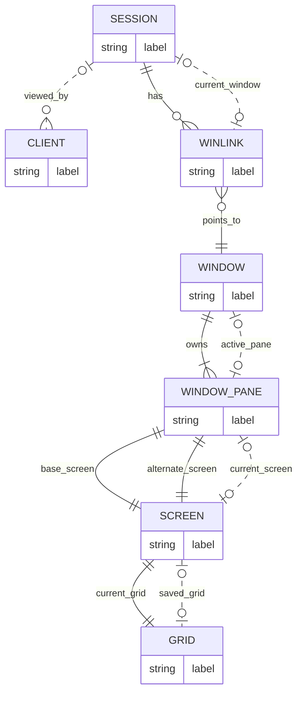

# zmux Architecture

## tmux: the answer to most open questions

- `tmux` is the behavioral oracle. Read the C when behavior is unclear. It is advised to read [docs/tmux-museum.md](./tmux-museum.md), which describes tools to facilitate exploration of the tmux code-base. AI agents may also use the museum skill to ingest this expertise.

## Identity

- zmux is a feature-compatible clone of tmux, but independent and distinct.
- Nesting tmux inside zmux, or zmux inside tmux, should work. Zmux uses its own configuration files and environment variables prefixed with "z" instead of "t", *unless* it is invoked as tmux (i.e., via a symlink or renamed binary). When invoked this way, zmux is intended to function as a fully compatible tmux replacement including configuration- and state-file, environment variable naming conventions, socket wire protocol, and anything else that may be considered an "interface."

## The Big Object Ownership Picture

From Window down to individual characters in the grid, tmux and zmux have a straightforward hierarchical ownership structure with Windows containing a list of panes, and each pane containing a screen (a couple of weird "extra" screens lurk elsewhere but they omitted for clarity) and each screen owning a grid of characters. Windows also contain "Layout" objects, not shown above, but these do not own the panes; instead they point to the panes, which, again, are owned by the Windows in a flat list. However there is a many-to-many relationship between Sessions and Windows (via WindowLinks intermediaries); furthermore many clients can look at one Session. Sessions are, in some sense, the uppermost objects in the stack, with Clients sort of off to the side, and Windows reference-counted via WindowLinks; when the last reference expires, so do the Window objects and all of their child objects.

## Stack Details

### Text and Cells

- `types.zig`, `utf8.zig`, `utf8-combined.zig` — UTF-8 payloads, decode helpers, width policy, combine policy
- `tty-acs.zig` — ACS-versus-UTF-8 drawing policy
- `grid.zig` — stored `GridCell` payloads, `string_cells` for capture
- `screen-write.zig` — glyph and cell writes into the live grid

### Prompt, Status, Message

- `status-prompt.zig` — prompt storage and editing over the cell model
- `format-draw.zig`, `status.zig`, `status-runtime.zig`, `menu.zig`—status, message, and menu-overlay presentation
- `server-print.zig`, `cmd-queue.zig`—attached/detached control output routing
- `control.zig`, `control-notify.zig`, `control-subscriptions.zig`—control-client pane-offset bookkeeping, notify, subscription polling

### Mouse, Redraw, TTY

- `window.zig`, `mouse-runtime.zig`, `server-fn.zig`, `tty-draw.zig`—pane hit-test, redraw, border, scrollbar
- `tty-term.zig`, `tty-features.zig`, `tty.zig`—terminfo and outer-tty capability path

### Layout and Geometry

- `layout.zig`—geometry-tree reconstruction, layout-dependent pane-resize

### Async Jobs

- `job.zig` — shared job registry, shell launcher, async completion
- `cmd-run-shell.zig`, `cmd-if-shell.zig` — consume the shared job interface
- `cmd-show-messages.zig` — job summary for `-J`
- `server.zig` — routes job child-exit status through `job_check_died`

## Design Principles

- We are currently shooting for a faithful port of tmux functionality. Mostly this is achieved by direct line-by-line porting of tmux behavior from C to zig. Until this work is complete, making the zig code idiomatic and beautiful is a low priority; pending work of this nature is documented in `docs/zmux-porting-debt.md`.
- Functional tmux-parity gaps go in `docs/zmux-porting-todo.md`.
- We strive to reuse shared lower layers when they carry truthful semantics.
- We strive to extend shared layers for missing semantics instead of adding local workarounds.
- Delete fixed todo entries instead of marking them resolved in place; in general the documentation should describe only the current state of the project, not the past, unless somehow that past is essential to understanding the present.